# Architektura Projektu

Ten dokument opisuje aktualną architekturę repozytorium `llms-facts-representation`. Oprócz storage-bounded treningu Top-K SAE dla `EleutherAI/pythia-160m` repozytorium zawiera eksperymentalną ścieżkę Gemma Scope 2 → semantic triage → pruning → MoE.

Główna idea aktywnego pipeline’u: sekwencjonujemy dane, generujemy aktywacje tylko wybranej warstwy przez hook, przekazujemy je w ograniczonych chunkach do trenera SAE i po każdym chunku zapisujemy resumable checkpoint. Pełny zbiór aktywacji nie jest przechowywany.

## Aktywna ścieżka treningu SAE

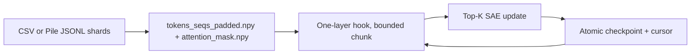

`activations_collecting.iter_activation_chunks()` wywołuje bezpośrednio
backbone GPT-Neo/GPT-NeoX, więc nie tworzy logitów słownika ani wszystkich
hidden states. Chunk zawiera wyłącznie ważne tokeny i jest zwalniany po
zakończeniu aktualizacji SAE. Wznowienie zaczyna się od `next_sequence`.

Dla Pythia używana jest struktura GPT-NeoX:

- `model.gpt_neox.layers[layer_num]` jako blok,
- `model.gpt_neox.layers[layer_num].mlp` jako MLP,
- `hidden_size=768`, `intermediate_size=3072`.

Sekcje opisujące domeny, pruning i MoE są niezależne od treningu lokalnego SAE;
mogą korzystać z gotowego SAE Gemma Scope 2 przez SAELens.

## Widok Wysokiego Poziomu

```mermaid
flowchart LR
  rawData["TinyStories CSV"] --> sequencing["Dataset Sequencing"]
  sequencing --> tokenSeqs["Token Sequences"]
  tokenSeqs --> activationCollection["Activation Collection"]
  activationCollection --> layerActivations["Selected Layer Hidden States"]
  layerActivations --> saeTraining["TopK SAE Training"]
  saeTraining --> saeCheckpoint["SAE Checkpoint"]
  saeCheckpoint --> featureAnalysis["Feature Analysis"]
  saeCheckpoint --> domainTriage["Semantic Domain Triage"]
  domainTriage --> domainValidation["Domain Validation Sets"]
  domainValidation --> mlpMapping["MLP SAE Mapping"]
  mlpMapping --> pruning["Domain MLP Pruning"]
  pruning --> mlpExperts["Sparse MLP Experts"]
  mlpExperts --> futureMoE["Hard Routed MoE + Dense Fallback"]
```

## Obecne Warstwy Systemu

### 1. Dane I Tokenizacja

Plik: `sae_pipeline/dataset_sequencing.py`

Wejście:

- `data/tinystories_dataset/train.csv` albo `validation.csv`,
- albo katalog z Pile-style `*.jsonl`, `*.jsonl.zst` lub `*.jsonl.gz` zawierającymi pole `text`,
- kolumna `text`,
- tokenizer `EleutherAI/gpt-neo-125M`.

Wyjście:

- `data/tinystories_dataset/sequenced/tokens_seqs_padded.npy`,
- `data/tinystories_dataset/dataset_info.json`.

Proces:

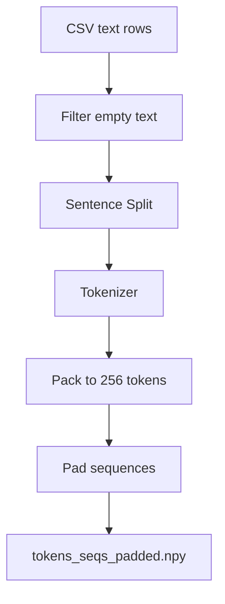

Dla JSONL shardy są iterowane plik po pliku i rekord po rekordzie. Opcje
`max-files`, `max-documents` i `max-tokens` ograniczają pilot albo rozmiar
produkcji bez kopiowania źródeł do katalogu roboczego. `dataset_info.json`
zawiera listę shardów oraz liczbę wykorzystanych dokumentów.

### 2. Ekstrakcja Aktywacji

Plik: `sae_pipeline/activations_collecting.py`

Ekstrahowany jest output wybranego bloku przez forward hook. Dla Pythia jest to
wyjście `model.gpt_neox.layers[layer_num]` przed końcową normą backbone’u;
chunk jest spłaszczany do ważnych tokenów i od razu przekazywany do SAE.

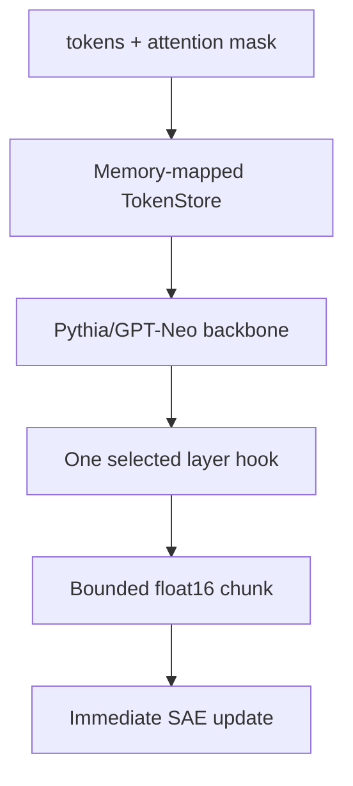

Wyjście nie zawiera pełnego pliku aktywacji. Trwałe są tokeny, maska oraz
checkpoint SAE z kursorem wznowienia.

### 3. Top-K SAE

Plik: `sae_pipeline/autoencoder_training.py`

Architektura:

- wejście `d_model=768` dla profilu Pythia (`64` pozostaje w profilu tiny),
- słownik `d_sae=12288` w profilu local-50gb,
- aktywność Top-K z `k=64` w profilu Pythia,
- dekoder `W_dec` o kształcie `d_sae x d_model`,
- loss MSE rekonstrukcji hidden state.

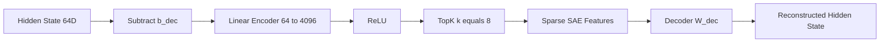

Wyjście:

- `topk_sae_layer_<layer>.pt`,
- `topk_sae_layer_<layer>_best.pt`,
- ograniczona liczba checkpointów krokowych.

### 4. Analiza Cech SAE

Plik: `sae_pipeline/features_analysis.py`

Ten etap analizuje aktywacje cech i logit lens.

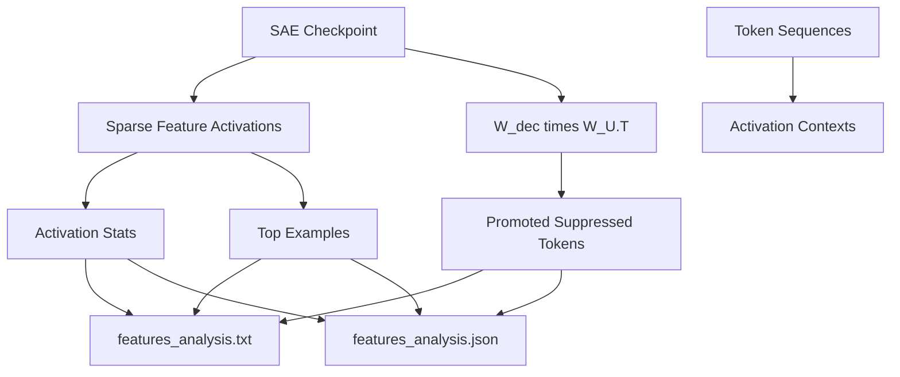

Aktualny stan po poprawkach:

- zapisuje raport tekstowy,
- zapisuje strukturalny JSON,
- używa parametru `layer_num`, a nie globalnej stałej,
- tworzy katalog `analysis/`, jeśli nie istnieje.

## Domeny Semantyczne

Plik: `domain_triage/semantic_domain_triage.py`

Cel: zgrupować cechy SAE w nadrzędne domeny przez podobieństwo logit-lens.

Skrypt obsługuje dwa źródła macierzy cech. Domyślna ścieżka liczy ją
bezpośrednio z decoderów SAE i unembeddingu modelu; parametr
`--feature-analysis` pozwala użyć już zapisanego `features_analysis.json`.
Ta druga ścieżka jest przeznaczona dla artefaktów Pythii, gdy raport analizy
jest dostępny, ale wagi bazowego modelu nie są obecne lokalnie. Dla Pythii
triage domyślnie można ograniczyć klasteryzację do cech obserwowanych w
analizie, a `--context-analysis` tworzy diagnostyczne zbiory walidacyjne z
zachowanych kontekstów aktywacji, jeśli nie ma osobnego pliku
`validation.csv`. Jeżeli zapisany raport kontekstów pochodzi z innego
checkpointu lub innego podzbioru danych, należy użyć `--include-unobserved-features`
oraz `--skip-validation`; zapobiega to mieszaniu cech i kontekstów z różnych
uruchomień.

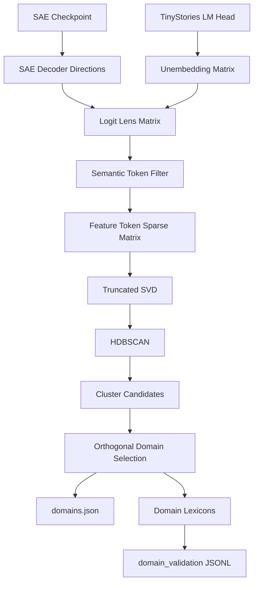

Artefakty:

- `feature_token_matrix.npz`,
- `logit_lens_top_tokens.jsonl`,
- `domains.json`,
- `feature_domain_assignments.csv`,
- `domain_report.md`,
- `domain_validation/domain_<id>.jsonl`,
- `domain_validation/all_domains_balanced.csv`,
- `domain_validation/validation_summary.json`.

Guardraile po poprawkach:

- częste tokeny funkcyjne są domyślnie odrzucane z reprezentacji domen,
- skrypt domyślnie wymaga co najmniej 3 wybranych domen,
- `domains.json` i raport zawierają diagnostykę: liczba klastrów, noise fraction, udział tokenów funkcyjnych w top tokenach,
- `--allow-underfilled-domains` pozwala zapisać słaby wynik tylko diagnostycznie.
- TF--IDF ogranicza wpływ tokenów współdzielonych przez wiele cech,
- `--max-domain-fraction` odrzuca jeden nadmiernie szeroki klaster ogólny,
- `--require-token-boundary` ogranicza kontynuacje BPE w nazwach domen.

## Dwa Rodzaje Mapowania

W repozytorium istnieją dwa poziomy mapowania i nie należy ich mylić.

### Mapowanie Residual Stream

Plik: `domain_mapping/topographic_mlp_sae_mapping.py`

To etap eksploracyjny. Mimo nazwy zmienna `mlp_activations` oznacza tutaj 64-wymiarowy hidden state warstwy, czyli tę samą przestrzeń, w której trenowany był SAE.

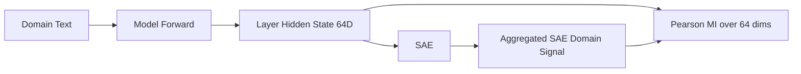

### Mapowanie Fizycznych Neuronów MLP

Plik: `domain_mapping/domain_mlp_activation_mapping.py`

To właściwy etap dla pruning. Adapter rozpoznaje GPT-Neo, GPT-NeoX oraz
gated-MLP Gemmy/Llamy. Hook wejścia projekcji wyjściowej przechwytuje fizyczny
wektor po aktywacji (`c_proj`/`dense_4h_to_h`) albo po bramkowaniu (`down_proj`).

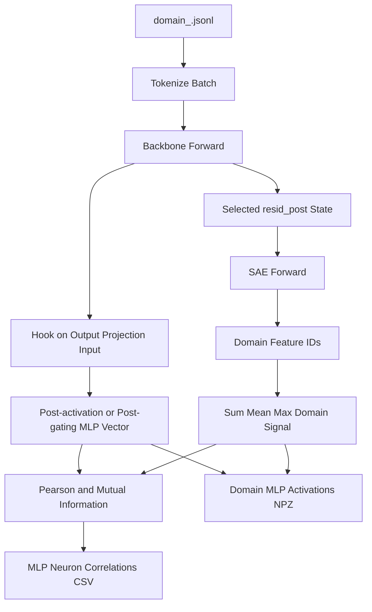

Guardraile po poprawkach:

- mapping odrzuca domenę z pustym albo prawie pustym sygnałem SAE,
- `--allow-zero-domain-signal` pozwala zapisać taki przypadek wyłącznie diagnostycznie,
- summary zapisuje diagnostykę sygnału domenowego.

## Pruning Ekspertów MLP

Plik: `domain_mapping/domain_mlp_pruning.py`

Wejście:

- `domain_mlp_mapping/domain_<id>_mlp_activations.npz`,
- `domain_mlp_mapping/domain_<id>_mlp_neuron_correlations.csv`.

Proces:

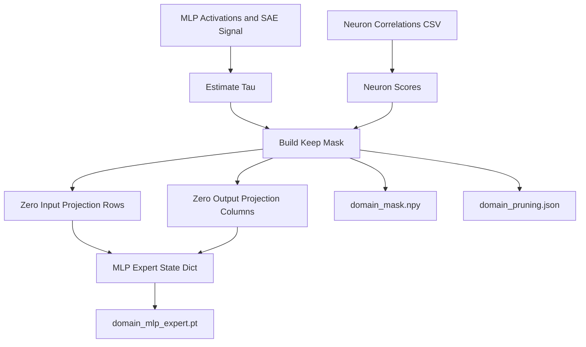

Metody progu:

- `per-domain-null` - permutuje bloki sygnału domeny i bierze percentyl rozkładu maksimum bezwzględnej korelacji po neuronach,
- `quantile` - bierze percentyl rzeczywistych score neuronów.

Guardraile po poprawkach:

- puste domeny domyślnie kończą się błędem,
- eksport eksperta z `0` zachowanymi neuronami jest blokowany,
- `--allow-empty-experts` służy tylko do diagnostyki,
- `--empty-signal-policy prune-all` bez `--allow-empty-experts` nie utworzy przypadkiem pustego eksperta.

## Aktualny Stan Zgodności Z SAE-Guided MoEfication

Zgodne albo częściowo zgodne:

- TinyStories-1M jako model bazowy,
- aktywacje warstwy 4,
- Top-K SAE `64 -> 4096`,
- logit lens,
- HDBSCAN na macierzy cecha-token,
- walidacje per domena,
- korelacja i MI między neuronami MLP a sygnałem domen SAE,
- pruning projekcji wejściowych i wyjściowej MLP do ekspertów,
- trening liniowego routera domenowego,
- składanie hard-routed MoE z kompaktowych MLP ekspertów i fallbackiem bazowym,
- walidacja PPL dla bazy, pojedynczych ekspertów i MoE.

Niezgodne albo brakujące:

- obecne lokalne artefakty miały tylko 2 domeny zamiast 3-5,
- jedna domena miała zerowy sygnał SAE,
- pełny eksperyment MoE wymaga ponownego uruchomienia na 3-5 niepustych domenach,
- brak niezależnie oznaczonych zbiorów development/holdout dla Gemmy,
- brak benchmarku wydajności kompaktowych ekspertów na docelowym GPU,
- brak kontroli causal-ablation oraz masek losowych i magnitude pruning.

## Architektura MoE

MoE składa się z trzech modułów: `moe/router_training.py`, `moe/moe_assembly.py` i `evaluation/moe_validation.py`.

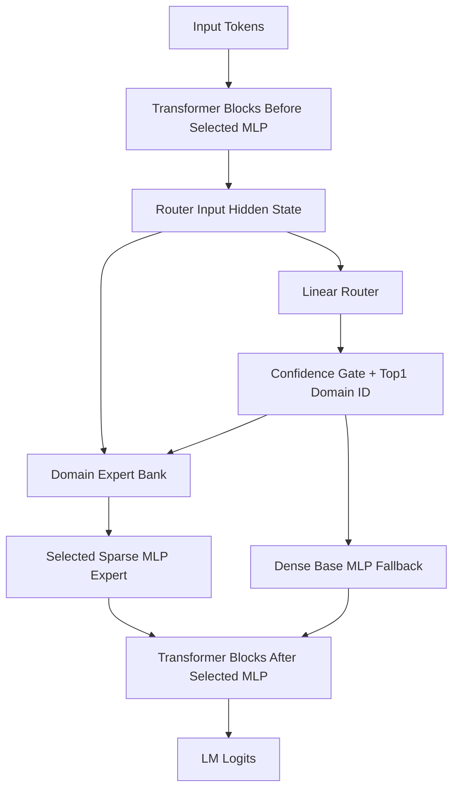

### Router Training

Plik: `moe/router_training.py`

Router jest liniowym klasyfikatorem domen:

- wejście: tensor przekazywany do MLP wybranej warstwy modelu,
- kształt wejścia: `[batch, seq_len, d_model]`,
- wyjście: `[batch, seq_len, n_domains]`,
- etykieta: domena tekstu z `domain_validation/domain_<id>.jsonl`, rozciągnięta na wszystkie nie-padding tokeny.

Podział train/validation jest grupowy po sekwencji źródłowej. Konteksty z tej
samej analizy SAE są oznaczone jako diagnostyczne i domyślnie nie mogą trenować
routera.

Artefakty:

- `router/router.pt` - checkpoint z `router_state_dict`, `domain_ids`, `domain_names`, `d_model`, `n_domains`, `layer_num`,
- `router/router_metrics.json` - historia treningu i metryki walidacyjne,
- `router/router_report.md` - czytelny raport per domena.

### MoE Assembly

Plik: `moe/moe_assembly.py`

Moduł ma dwa tryby:

- `build_single_expert_model()` podstawia jeden `domain_<id>_mlp_expert.pt` za MLP wybranej warstwy.
- `build_hard_routed_moe()` ładuje `router.pt`, bank ekspertów i zastępuje MLP wrapperem `HardRoutedMLP`.

`HardRoutedMLP` wykonuje Top-1 routing per token:

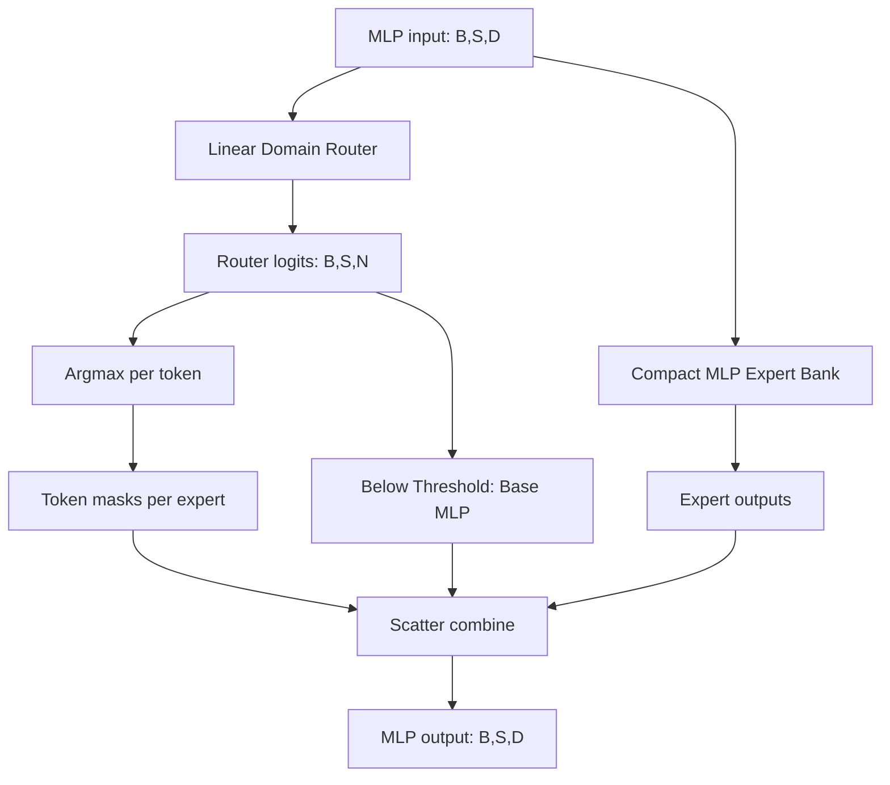

Guardraile:

- router `d_model` musi zgadzać się z `model.config.hidden_size`,
- `layer_num` i `model_name` routera oraz ekspertów muszą być zgodne,
- eksperci diagnostycznie puste są blokowane bez jawnej flagi.
- próg ufności routera decyduje o użyciu domeny albo bazowego MLP,
- ekspert jest liczony tylko dla przypisanych tokenów i ma fizycznie zmniejszony wymiar pośredni.

### PPL Validation

Plik: `evaluation/moe_validation.py`

Walidacja liczy causal LM loss i perplexity dla:

- modelu bazowego na ogólnym `validation.csv` i per domena,
- pojedynczego eksperta na jego własnej domenie,
- hard-routed MoE na ogólnym `validation.csv` i per domena.

Końcowy run wymaga osobnego pliku domenowego `domain_id,text` oraz ogólnego
holdoutu niewykorzystanego w triage'u. Ponowne użycie danych rozwojowych wymaga
jawnej flagi diagnostycznej.

Artefakty:

- `moe_validation/ppl_results.json`,
- `moe_validation/ppl_report.md`.

## Przepływ Eksperymentalny Po Poprawkach

```mermaid
flowchart LR
  step1["Run sae_pipeline/main.py"] --> step2["Run domain_triage/semantic_domain_triage.py"]
  step2 --> checkDomains["Require 3 to 5 Nonempty Domains"]
  checkDomains --> step3["Run domain_mapping/domain_mlp_activation_mapping.py"]
  step3 --> checkSignals["Require Nonzero SAE Signals"]
  checkSignals --> step4["Run domain_mapping/domain_mlp_pruning.py"]
  step4 --> checkExperts["Require Nonempty Experts"]
  checkExperts --> routerStep["Run moe/router_training.py"]
  routerStep --> moeStep["Run moe/moe_assembly.py"]
  moeStep --> pplStep["Run evaluation/moe_validation.py"]
```

## Znane Ryzyka

- HDBSCAN może zwrócić za mało klastrów przy zbyt dużym `min_cluster_size`.
- Nadmierne filtrowanie tokenów może odrzucić zbyt dużo cech, ale zbyt słabe filtrowanie daje domeny typu `the / it / one`.
- Domenowe dane rozwojowe są oparte na leksykonach top tokenów, więc mogą nie łapać parafraz i nie są niezależną ewaluacją.
- Prawdziwy pruning powinien używać `domain_mapping/domain_mlp_activation_mapping.py`, a nie eksploracyjnego `domain_mapping/topographic_mlp_sae_mapping.py`.
- Router jest trenowany tokenowo, ale etykiety pochodzą z poziomu tekstu, więc raport metryk trzeba interpretować ostrożnie.
- Nieregularne, małe grupy tokenów mogą zniwelować korzyść z kompaktowych ekspertów; wymagany jest benchmark na docelowym GPU.
