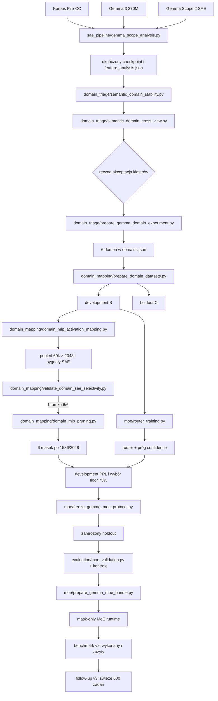

# Przepływ eksperymentu

## Widok całościowy

Przepływ Pythia z własnym Top-K SAE pozostaje dostępny przez
`sae_pipeline/dataset_sequencing.py → sae_pipeline/activations_collecting.py → sae_pipeline/autoencoder_training.py →
sae_pipeline/features_analysis.py`, ale wykonany eksperyment MoE opiera się na gotowym SAE
Gemma Scope 2.

## Rozdzielenie danych

| Zbiór | Funkcja | Czy można stroić? |
| --- | --- | --- |
| Discovery A | analiza SAE, logit lens, klasteryzacja | tak, ale wynik wymaga raportowania stabilności |
| Development B | mapping, selektywność, pruning, router, kalibracja progu | tak |
| Holdout C | końcowa kontrola PPL i baseline'y | nie; został już zużyty |
| Benchmark D/v2 | niezależne zadania kompetencyjne | nie; wykonany i zużyty |
| Follow-up D/v3 | świeże zadania, prostsza matematyka i MC order variants | nie; gotowy do runu |

Konteksty z analizy cech są diagnostyczne. Finalny development i holdout
pochodzą z jawnych źródeł z rozłącznymi hashami i grupami. Benchmark D używa
innych repozytoriów niż wcześniejsze etapy.

## Kluczowe kontrakty numeryczne

1. SAE ma `d_in=640`, `d_sae=16384` i hook
   `blocks.9.hook_resid_post`.
2. Mapping przechwytuje `act(gate_proj(x)) * up_proj(x)`, czyli fizyczne
   postaktywacje `H=2048`, a nie residual stream `D=640`.
3. Każda domena jest oceniana na tych samych 60 000 tokenach.
4. Selektywność i bootstrap są agregowane na poziomie tekstu.
5. Maska pruningu dotyczy obu projekcji wejściowych i kolumn `down_proj`.
6. Router działa na wejściu MLP; trening jest text-balanced i group-aware.
7. Hard routing liczy tylko jeden ekspert albo gęsty fallback per token.
8. Padding nie uczestniczy w loss ani telemetrii routingu.

## Artefakty wykonanego eksperymentu

Bazowy katalog to
`data/gemma_scope2_270m_pilecc/analysis/domain_triage_selected_6_20260914`.

| Etap | Artefakty |
| --- | --- |
| wybór domen | `domains.json`, `domain_report.md` |
| dane | `dataset_manifest.json`, `development_*.csv`, `holdout_*.csv` |
| mapping | `domain_mlp_mapping/pooled_mlp_activations.npz`, CSV korelacji, `summary.json` |
| selektywność | `domain_mlp_mapping/selectivity/{selectivity_results.json,*.csv,*.md}` |
| pruning | `domain_mlp_experts_floor75/domain_<id>_mask.npy`, pełne stany audytowe, summary |
| router | `router/router.pt`, `router_metrics.json`, `router_report.md` |
| zamrożenie | `holdout_protocol_frozen.json` |
| holdout | `moe_validation_holdout_frozen/`, korekta w `moe_routing_telemetry_corrected/` |
| audyt korekty | `post_holdout_telemetry_correction.json` |
| runtime | `moe_bundle.json` |
| benchmark historyczny | `independent_benchmark_v2_sealed/{benchmark.jsonl,benchmark_manifest.json}` |
| benchmark follow-up | `independent_benchmark_v3_sealed/{benchmark.jsonl,benchmark_manifest.json}` |

## Kolejność reprodukcji

Kolejność jest częścią protokołu:

1. sfinalizować analizę Gemma Scope;
2. sprawdzić stabilność i cross-view;
3. ręcznie zatwierdzić domeny;
4. przygotować i zweryfikować dane;
5. wykonać pooled mapping;
6. wymusić bramkę selektywności;
7. wybrać sparsity wyłącznie na development;
8. wytrenować router i skalibrować fallback na development general;
9. zamrozić hashe i parametry;
10. otworzyć holdout tylko raz;
11. zbudować manifest runtime;
12. uruchomić niezależny, zapieczętowany benchmark bez dalszego strojenia.

Dokładne wyniki i interpretację zawiera [opis wykonanego eksperymentu](gemma_moe_experiment.md).
