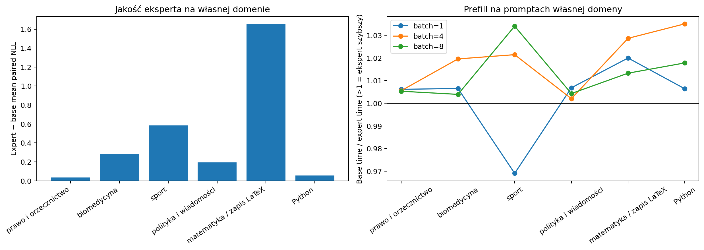

# Walidacja samodzielnych ekspertów domenowych Gemma 3 270M — benchmark v3

Data analizy: 15 września 2026 r.  
Zakres: sześć zwartych ekspertów MLP warstwy 9, każdy oceniony na 100
przykładach swojej domeny, oraz bazowa Gemma 3 270M.  
Konstrukcja eksperta: 1536/2048 neuronów MLP, bez routera i bez gęstego
fallbacku; wybrany ekspert przetwarza wszystkie tokeny wejścia.

## Najważniejszy wynik

Samodzielni eksperci są **nieznacznie szybsi i mniejsi od modelu bazowego, ale
nie zachowują jego jakości w wystarczającym stopniu**. Dla wspólnego portfela
sześciu pomiarów prefill czas spadł o 0,23% dla batch=1, 1,23% dla batch=4 i
0,77% dla batch=8. Bazowa alokacja CUDA była niższa o 1,25 MiB. Jest to
rzeczywista, lecz mała oszczędność, zgodna z tym, że pruning obejmuje tylko
jedną z 18 warstw MLP.

Koszt jakości jest znacznie większy. Tokenowo ważone reference NLL wzrosło z
1,18181 do 1,26987, a PPL z 3,2603 do 3,5604, czyli o 9,21%. Pogorszenie jest
szczególnie duże dla matematyki, sportu i biomedycyny. Łączne accuracy zadań
multiple choice prawie się nie zmieniło: 156/500 = 31,2% dla bazy i 157/500 =
31,4% dla ekspertów (`p=1,0`). Nie jest to jednak dowód zachowania
kompetencji, ponieważ model wykazuje silny bias pozycyjny. Najbardziej
praktyczna miara dla eksperta Python również wypada źle: poprawność składni
spadła z 96% do 74% (`p=0,0000105`).

W obecnej formie eksperci są wartościowym PoC strukturalnego pruningu, ale nie
są jeszcze dobrymi zamiennikami modelu bazowego ani gotowym komponentem
produkcyjnego MoE.



## 1. Integralność i konfiguracja

Model bazowy oceniono na 600 przykładach, a każdego eksperta wyłącznie na 100
przykładach przypisanej mu domeny (`evaluate_cross_domain=false`). Wszystkie
600 identyfikatorów tworzy kompletne pary base–właściwy ekspert. Nie ucięto
żadnego promptu w teacher-forced evaluation. Użyto `batch_size=8`,
`max_length=1024`, trzech deterministycznych wariantów kolejności odpowiedzi i
seeda `20260916`; binarny sport ma dwa unikalne warianty. Przedziały zapisane
przez benchmark opierają się na 2000 replikach bootstrapu.

Zbiór v3 został wcześniej wykorzystany do oceny MoE. Zgodnie z metadanymi
runu ta analiza ekspertów ma więc status **post-hoc i eksploracyjny**. Nie
wolno wybierać na jej podstawie najlepszych masek, szerokości ekspertów ani
warstw, a następnie przedstawiać wyniku na tych samych rekordach jako
niezależnego testu.

Najważniejsze sumy kontrolne SHA-256:

| Plik | SHA-256 |
| --- | --- |
| `base_teacher_forced.json` | `42ea60372ebe4ed2808f2eda9c3c930b3fc428c8a2151d74c1b4cb666b44834a` |
| `expert_0_teacher_forced.json` | `6be6fe68018a7bc464b2f5398aafe82a67a06fb0e09a45894db0ebf2825326f6` |
| `expert_1_teacher_forced.json` | `a1ca4fbbcd9222e58828f6525a2cf16a2a19145bed43afe60ad6abc79fc8aa2e` |
| `expert_2_teacher_forced.json` | `ce468148ad34f82b43ce0ae5f95d355f9cfc0b77bf877dfb34d47d58e3c2e93e` |
| `expert_3_teacher_forced.json` | `084a16e764ee5813ebfa333fa004c00ded3889b9819299f4c051d715ffdf9dee` |
| `expert_4_teacher_forced.json` | `13a51e9b2be910ec04ba97a898766b35cd36e0f0e18c564547a125f2f429da42` |
| `expert_5_teacher_forced.json` | `eaf7171d0de132db6476f5ba894ff763a30c2e64d2ca5b5adcfe06b2c9952486` |
| `expert_prefill_runtime_summary.csv` | `8619d4ae771f5464e6a3bc1eb772efd752a4eb99654879856a52ff72d89078fd` |
| `python_generation_summary.json` | `dec21d8c375b0d16b5de9af04843c802626eb7ad87da2b3d13c9923c6a22fe86` |
| `standalone_expert_summary.json` | `ed12a5675dd704f8e896e38330a18a821c8ba997ca650fc54ac8d6c5de86d539` |

## 2. Teacher-forced reference NLL

Niższe NLL jest lepsze. `Δ NLL = ekspert − base`, więc dodatnia wartość
oznacza pogorszenie. Base/expert NLL jest ważone liczbą tokenów referencji w
obrębie domeny, natomiast średnie Δ i przedziały ufności są sparowane na
poziomie przykładów.

| Domena | Base NLL | Ekspert NLL | Średnie sparowane Δ | 95% CI | Zmiana PPL |
| --- | ---: | ---: | ---: | --- | ---: |
| prawo i orzecznictwo | 1,7155 | 1,7518 | +0,0363 | [−0,0005; +0,0719] | +3,70% |
| biomedycyna | 1,6244 | 1,9089 | +0,2845 | [+0,2363; +0,3333] | +32,91% |
| sport | 1,7815 | 2,3668 | +0,5853 | [+0,5468; +0,6231] | +79,55% |
| polityka i wiadomości | 1,5923 | 1,7863 | +0,1940 | [+0,1553; +0,2327] | +21,41% |
| matematyka / zapis LaTeX | 2,6451 | 4,2974 | +1,6522 | [+1,5677; +1,7345] | +421,87% |
| Python | 1,1293 | 1,1821 | +0,0554 | [+0,0459; +0,0651] | +5,43% |

W pięciu domenach średnia różnica jest jednoznacznie dodatnia; tylko dla prawa
CI minimalnie obejmuje zero. Ekspert uzyskał niższe NLL jedynie dla 80/600 =
13,33% przykładów. Eksploracyjnie policzona makrośrednia różnic po wszystkich
600 parach wynosi `+0,46797`, z bootstrapowym 95% CI `[+0,41942; +0,51778]`
(10 000 replik, seed `20260915`).

Agregat tokenowy wymaga ostrożności: przykłady Python zawierają 6567 z 7067
tokenów referencyjnych, czyli 92,93%. Łączne NLL 1,18181→1,26987 i PPL
3,2603→3,5604 opisują więc głównie domenę Python. Makrośrednia sparowana z
kolei przypisuje równą wagę krótkiemu tokenowi odpowiedzi MC i całemu
fragmentowi kodu. Obie agregacje mają ograniczenia, ale obie wskazują
pogorszenie.

### Diagnostyka etykiet MC

Wyniki sportu i matematyki opierają się na NLL jednoznakowych etykiet `A`–`D`.
Post-hoc normalizacja wyłącznie w zbiorze kandydatów zmienia obraz sportu:
candidate-normalized CE spada tam z 0,7680 do 0,7242 mimo wzrostu absolutnego
reference NLL o 0,5853. W matematyce CE rośnie z 1,4476 do 1,7282. Oznacza to,
że w sporcie pruning zmniejszył bezwzględne prawdopodobieństwo etykiet, lecz
nie pogorszył ich względnego rankingu. Jest to diagnostyka nieuwzględniona w
zamrożonym protokole, a nie dodatkowa metryka główna.

## 3. Multiple choice i warianty kolejności

### Pierwotna kolejność

| Domena | Base | Ekspert | Zmiana | Przejścia sparowane | Exact `p` |
| --- | ---: | ---: | ---: | --- | ---: |
| prawo | 21% | 22% | +1 p.p. | 9 błędnych→poprawne, 8 poprawnych→błędne | 1,000 |
| biomedycyna | 29% | 31% | +2 p.p. | 5 błędnych→poprawne, 3 poprawne→błędne | 0,727 |
| sport | 50% | 50% | 0 p.p. | 1 błędny→poprawny, 1 poprawny→błędny | 1,000 |
| polityka | 35% | 33% | −2 p.p. | 3 błędne→poprawne, 5 poprawnych→błędne | 0,727 |
| matematyka | 21% | 21% | 0 p.p. | brak zmian poprawności | 1,000 |
| **łącznie** | **31,2%** | **31,4%** | **+0,2 p.p.** | 18 błędnych→poprawne, 17 poprawnych→błędne | **1,000** |

Accuracy nie wykazuje ani przewagi, ani dużej katastrofalnej regresji. Ten
pozornie neutralny wynik nie unieważnia pogorszenia NLL: decyzja `argmin` może
pozostać ta sama mimo silnej zmiany kalibracji lub marginesu.

### Wynik po permutacjach

| Domena | Base variant accuracy | Ekspert | Δ | 95% CI Δ | Zgodność odpowiedzi eksperta między wariantami |
| --- | ---: | ---: | ---: | --- | ---: |
| prawo | 22,67% | 26,67% | +4,00 p.p. | [−0,33; +8,33] | 58,00% |
| biomedycyna | 26,00% | 24,33% | −1,67 p.p. | [−5,33; +2,00] | 56,33% |
| sport | 50,00% | 49,50% | −0,50 p.p. | [−1,50; 0,00] | 50,50% |
| polityka | 30,33% | 29,33% | −1,00 p.p. | [−3,67; +1,67] | 57,33% |
| matematyka | 24,33% | 24,33% | 0,00 p.p. | [0; 0] | 52,33% |
| **łącznie** | **30,67%** | **30,83%** | **+0,17 p.p.** | **[−1,10; +1,43]** | — |

Warianty kolejności również nie potwierdzają poprawy. Pokazują natomiast, że:

- ekspert matematyczny, tak jak baza, wybrał wyświetloną odpowiedź A we
  wszystkich 300 ocenach;
- baza sportowa wybrała A w 200/200 ocen, a ekspert sportowy w 195/200;
- w prawie, biomedycynie i polityce nadal silnie dominuje ostatnia pozycja D;
- średnia zgodność semantycznej odpowiedzi między wariantami wynosi tylko
  około 50–58%.

Wynik 50% w binarnym sporcie i około 24% w czteroklasowej matematyce nie
świadczy więc o wiedzy eksperta. Powtarzanie identycznej deterministycznej
inferencji nie usunęłoby problemu; właśnie permutacje ujawniają wybieranie
pozycji zamiast stabilnej odpowiedzi semantycznej.

## 4. Matematyka elementarna

Ekspert matematyczny nie zmienił ani jednej decyzji względem bazy. Rozbicie na
operacje wygląda następująco:

| Operacja | Base / ekspert — poprawne | Variant accuracy obu modeli | Średnie Δ NLL |
| --- | ---: | ---: | ---: |
| dodawanie | 2/25 | 18,67% | +1,7241 |
| odejmowanie | 4/25 | 22,67% | +1,7890 |
| mnożenie | 7/25 | 28,00% | +1,5576 |
| dzielenie | 8/25 | 28,00% | +1,5383 |

Identyczne odpowiedzi przy bardzo dużym wzroście NLL oznaczają pogorszenie
kalibracji bez wykrywalnej zmiany zachowania `argmin`. Ponieważ oba modele
zawsze wybierają A, benchmark nie pokazuje, że ekspert wykonuje działania.

## 5. Generacja Pythona

| Wariant | Parsowalny, niepusty AST |
| --- | ---: |
| base | 96/100 = 96% |
| ekspert Python | 74/100 = 74% |

W parach wystąpiły 2 zmiany `błędna→poprawna` i 24 zmiany
`poprawna→błędna`; dokładny test daje `p=0,0000105`. Spadek o 22 p.p. jest
zatem silnym negatywnym sygnałem. Jest spójny z wyższym NLL kodu
referencyjnego (`+0,0554`, CI `[+0,0459; +0,0651]`).

Analiza błędnych ciągów funkcją `extract_python_code()` i parserem AST wskazuje
7 niedomkniętych nawiasów okrągłych, 7 niedomkniętych list oraz m.in.
niedomknięte napisy i bloki. 24 z 26 błędnych generacji eksperta kończą się w
sposób zgodny z ucięciem w środku konstrukcji. To sugeruje częstsze
rozwlekłe/powtarzalne generacje osiągające limit `max_new_tokens=160`, lecz
pliki nie zapisują `finish_reason` ani liczby wygenerowanych tokenów, więc nie
można tego potwierdzić formalnie.

Metryka nadal sprawdza tylko składnię, nie działanie programu. Bez wykonania
testów MBPP w izolowanym środowisku nie wolno nazywać jej pass@1 ani twierdzić,
że 74% programów rozwiązuje zadanie.

## 6. Oszczędność obliczeń — teoria

Gemma 3 270M ma `D=640`, szerokość MLP `H=2048` i 18 warstw. Gated MLP ma
trzy projekcje liniowe, dlatego koszt jednej warstwy na token wynosi:

```text
C_dense  = 3 × 640 × 2048 = 3 932 160 MAC
C_expert = 3 × 640 × 1536 = 2 949 120 MAC
oszczędność = 983 040 MAC/token
```

Każdy ekspert usuwa 25% obliczeń MLP warstwy 9. Ponieważ jest zawsze aktywny,
nie ma kosztu routera ani fallbacku. Odpowiada to jednak tylko 1/18 wszystkich
MLP, więc redukcja dla całego stosu MLP wynosi **1,389%**. Względem liniowych
projekcji całego backbone'u jest to około 0,98%, a po doliczeniu kosztownej
głowy słownikowej około 0,37%. Udział będzie jeszcze mniejszy po uwzględnieniu
operacji attention zależnych od długości sekwencji. Są to szacunki MAC, nie
pomiary czasu ani energii.

Liczba parametrów spada z 268 098 176 do 267 115 136, czyli o 983 040 =
**0,367%**. Dla wag BF16 same usunięte parametry odpowiadają teoretycznie około
1,88 MiB, ale rzeczywista alokacja zależy od implementacji i alokatora CUDA.

## 7. Empiryczna wydajność prefill

Pomiar wykonano na `cuda:0`, na dopasowanych promptach każdej domeny, z
`max_length=512`, trzema iteracjami warm-up i 20 zsynchronizowanymi
powtórzeniami. Poniższa tabela podaje zmianę mediany czasu eksperta względem
bazy; wartość ujemna oznacza przyspieszenie.

| Domena | Batch 1 | Batch 4 | Batch 8 |
| --- | ---: | ---: | ---: |
| prawo | −0,61% | −0,55% | −0,53% |
| biomedycyna | −0,65% | −1,92% | −0,39% |
| sport | **+3,20%** | −2,10% | −3,30% |
| polityka | −0,68% | −0,20% | −0,43% |
| matematyka | −1,96% | −2,79% | −1,31% |
| Python | −0,64% | −3,39% | −1,75% |

Dla sumy sześciu dopasowanych workloadów:

| Batch | Base — suma median | Eksperci — suma median | Zmiana czasu | Łączny throughput base → ekspert |
| ---: | ---: | ---: | ---: | ---: |
| 1 | 198,89 ms | 198,43 ms | **−0,23%** | 2368 → 2374 tok./s |
| 4 | 550,40 ms | 543,64 ms | **−1,23%** | 4250 → 4302 tok./s |
| 8 | 1021,45 ms | 1013,57 ms | **−0,77%** | 4676 → 4712 tok./s |

W 17 z 18 konfiguracji ekspert jest szybszy; wyjątkiem jest sport przy
batch=1. Efekt ma oczekiwany kierunek, ale jest mały. Surowe czasy 20 iteracji
nie zostały zapisane, więc nie można policzyć przedziału ufności dla różnicy
ani formalnie odróżnić części efektów rzędu 0,2–0,7% od wariancji pomiarowej.
IQR stanowi 0,44–4,28% mediany dla bazy i 0,31–4,20% dla ekspertów. Najbardziej
wiarygodny praktyczny wniosek brzmi zatem: **zwarte MLP usuwa narzut routingu i
daje mały sygnał przyspieszenia, ale nie wykazano dużej oszczędności czasu**.

Pomiar dotyczy wyłącznie prefilla, a nie autoregresyjnego decode ani energii.
Nie wolno przeliczać go bezpośrednio na koszt całej usługi inferencyjnej.

### Pamięć GPU

Bazowa alokacja CUDA eksperta jest w każdym pomiarze niższa o 1,25 MiB.
Całkowity peak allocated VRAM zmienia się od −1,875 do +0,125 MiB, a przyrost
peak ponad stan po załadowaniu modelu od −0,625 do +1,375 MiB. Oznacza to małą
oszczędność pamięci wag, podczas gdy chwilowy koszt aktywacji i zachowanie
alokatora potrafią ją zamaskować.

Wynik dotyczy **jednego załadowanego eksperta**. Równoczesne utrzymywanie
sześciu pełnych samodzielnych modeli nie byłoby oszczędne; sensowny wariant
wdrożeniowy musiałby współdzielić wspólny backbone albo ładować ekspertów
zamiennie.

## 8. Porównanie z hard-routed MoE

Porównanie jest opisowe, ponieważ oba warianty oceniono na tym samym zużytym
benchmarku v3. Właściwi eksperci uzyskali 157/500 poprawnych odpowiedzi MC,
a MoE 158/500. Największa różnica występuje w Pythonie: samodzielny ekspert ma
74% poprawnej składni, podczas gdy MoE osiągnęło 94%. Gęsty fallback MoE
przetwarzał większość tokenów Python i najwyraźniej ochronił model przed
pełnym kosztem pruningu.

Teacher-forced NLL samodzielnego eksperta jest gorsze od MoE w pięciu z sześciu
domen: różnica expert−MoE wynosi +0,0336 dla prawa, +0,2670 dla biomedycyny,
+0,1948 dla polityki, +0,5453 dla matematyki i +0,0356 dla Pythona. Wyjątkiem
jest sport (`−0,2149`), gdzie router MoE często kierował tokeny do niewłaściwego
eksperta matematycznego. Pokazuje to dwa odrębne problemy: pełne stosowanie
pruningu obniża jakość, a błędny routing może obniżyć ją jeszcze bardziej.

Samodzielny ekspert jest za to szybszy i mniejszy od bazy, podczas gdy
wcześniejszy MoE był wolniejszy o 0,81–10,12% i zajmował około 35,4 MiB więcej
pamięci bazowej GPU. Różnica wynika z braku dispatchu, routera, fallbacku i
banku sześciu dodatkowych MLP. Jest to argument za zwartym pruningiem, ale nie
rekompensuje obecnego kosztu jakości.

## 9. Ograniczenia badawcze

- Każdy ekspert został oceniony tylko w swojej domenie. Brak macierzy
  ekspert×domena uniemożliwia stwierdzenie, czy maski są rzeczywiście
  specjalistyczne, czy po prostu różnie szkodliwymi maskami pruningowymi.
- Brakuje matched random masks, maski wspólnej i kilku seedów. Nie da się
  oddzielić wartości doboru semantycznego od efektu zachowania dowolnych 75%
  neuronów.
- Benchmark v3 jest już zużyty i nie może służyć równocześnie do wyboru
  konfiguracji oraz końcowej walidacji.
- Przedziały per domena nie mają korekty za wielokrotne porównania.
- Accuracy MC jest silnie zaburzone przez bias pozycyjny małego modelu.
- Parsowalność Pythona nie mierzy poprawności funkcjonalnej, a brak
  `finish_reason` utrudnia diagnozę uciętych generacji.
- Runtime nie przechowuje surowych powtórzeń i obejmuje tylko prefill na jednym
  GPU oraz jednym układzie kerneli.
- Nie zmierzono energii, kosztu transferu/ładowania eksperta ani wyboru domeny
  przez zewnętrzny klasyfikator.

## 10. Co można wnioskować

### Uzasadnione

- Kod tworzy faktycznie zwarte MLP: wycina wiersze `gate_proj` i `up_proj` oraz
  odpowiadające kolumny `down_proj`, a nie tylko zeruje wagi.
- Pruning 25% neuronów jednej warstwy daje małą oszczędność parametrów,
  pamięci i najczęściej czasu prefill.
- Accuracy MC pozostaje prawie niezmienione, ale NLL pogarsza się w każdej
  domenie, a ekspert Python wyraźnie częściej generuje nieparsowalny kod.
- Brak routera usuwa koszt i błędy routingu, lecz oznacza stosowanie pruningu do
  każdego tokenu, co zwiększa koszt jakości względem MoE z fallbackiem.
- Obecny eksperyment wspiera wykonalność techniczną samodzielnych ekspertów,
  nie ich przewagę jakościową.

### Nieuzasadnione

- Nie można twierdzić, że eksperci zachowali jakość tylko dlatego, że łączna
  accuracy różni się o jeden punkt na 500 pytań.
- Nie można interpretować 50% sportu ani 24,33% matematyki jako kompetencji
  domenowej.
- Nie można utożsamiać 25% pruningu jednego MLP z 25% oszczędnością całego
  modelu; obserwowany speed-up wynosi około 0–3%, a agregat mniej niż 1,3%.
- Nie można stwierdzić specjalizacji bez porównania każdego eksperta na wielu
  domenach i z maskami losowymi.
- Nie można twierdzić, że ekspert Python rozwiązuje 74% zadań MBPP bez testów
  funkcjonalnych.
- Wynik nie dowodzi przyczynowej lokalizacji wiedzy w zachowanych neuronach.

## 11. Zalecane dalsze kroki

1. Zamrozić nowy, niezależny test v4; strojenie prowadzić na osobnym dev secie.
2. Uruchomić pełną macierz ekspert×domena oraz porównać maskę właściwej domeny
   z maskami innych domen, wspólną maską globalną i matched random masks.
3. Powtórzyć pruning dla kilku seedów i szerokości, np. 90%, 85% i 75%
   zachowanych neuronów, wyznaczając krzywą jakość–compute.
4. Dodać warianty wyboru warstwy i pruning wielu warstw dopiero po ustaleniu,
   czy maska semantyczna daje przewagę nad baseline'em losowym.
5. Zmienić MC na odpowiedzi treścią lub format bez etykiet pozycyjnych;
   prompt ustalić na zbiorze development.
6. Zapisywać `finish_reason`, liczbę nowych tokenów i wykonywać testy MBPP w
   izolowanym runnerze, raportując funkcjonalne pass@1.
7. Zapisywać surowe czasy wszystkich iteracji i mierzyć osobno prefill, decode,
   energię oraz transfer ekspertów.
8. Jeżeli celem jest wdrożenie, współdzielić backbone i materializować tylko
   wybrany zwarty MLP; nie utrzymywać sześciu pełnych kopii modelu.

## Konkluzja do pracy

> Strukturalny pruning 25% neuronów MLP warstwy 9 Gemma 3 270M umożliwił
> utworzenie sześciu zwartych ekspertów domenowych bez routera i gęstego
> fallbacku. Eksperci zmniejszają liczbę parametrów całego modelu o 0,367%,
> bazową alokację CUDA o 1,25 MiB i medianę czasu prefill o około 0,23–1,23%
> w agregacji workloadów. Oszczędność ta jest zgodna z redukcją tylko 1,389%
> kosztu wszystkich MLP i pozostaje niewielka. Jednocześnie tokenowo ważone
> PPL rośnie o 9,21%, NLL pogarsza się we wszystkich domenach, a poprawność
> składni generowanego Pythona spada z 96% do 74%. Niemal niezmienione
> accuracy MC jest niewystarczającym dowodem zachowania jakości ze względu na
> silny bias pozycyjny. Eksperyment potwierdza techniczną wykonalność zwartego
> pruningu i jego małą korzyść wydajnościową, lecz nie potwierdza, że obecne
> maski tworzą użytecznych ani semantycznie wyspecjalizowanych ekspertów.
