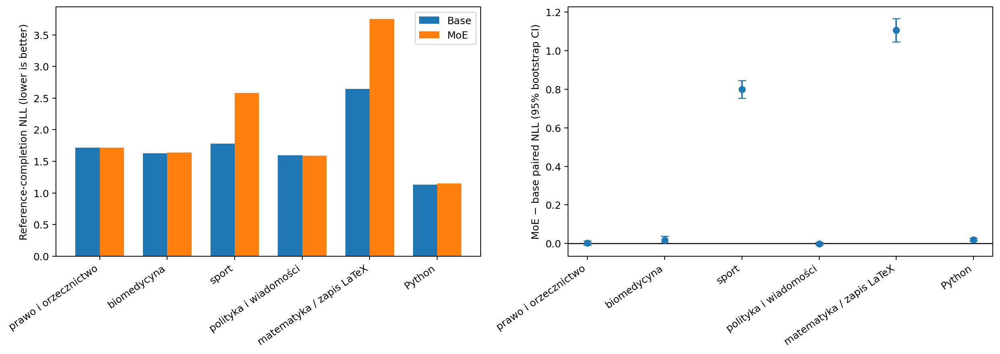

# Walidacja Gemma 3 270M MoE — benchmark v3

Data analizy: 15 września 2026 r.  
Zakres: 600 nowych, zapieczętowanych przykładów, po 100 dla sześciu domen.  
Porównanie: bazowa Gemma 3 270M kontra hard-routed MoE z sześcioma ekspertami
MLP warstwy 9, zachowującymi po 1536/2048 neuronów, oraz gęstym fallbackiem.

## Najważniejszy wynik

Benchmark v3 **nie wykazał przewagi jakościowej ani wydajnościowej MoE**.
Accuracy w pierwotnej kolejności odpowiedzi wzrosło jedynie z 156/500 =
31,2% do 158/500 = 31,6%. Sparowana różnica +0,4 p.p. ma bootstrapowe 95% CI
od −1,0 do +1,8 p.p. i dokładne `p=0,774`, więc jest zgodna z przypadkowym
wahaniem. Po uśrednieniu wariantów kolejności wynik zmienił się z 30,67% do
31,27%, również bez rozstrzygającego efektu.

Teacher-forced reference NLL jest wyższe dla MoE, szczególnie w sporcie i
matematyce. W tych dwóch domenach trzeba jednak zachować ostrożność: model ma
silny bias do etykiety znajdującej się na pierwszej pozycji. Nie zmienia
decyzji po przetasowaniu opcji, a duża część wzrostu absolutnego NLL opisuje
kalibrację tokenów `A`–`D`, nie utratę wykazanej umiejętności rozwiązywania.

Empiryczny benchmark prefill rozstrzyga kwestię praktycznej oszczędności dla
tej implementacji: MoE było wolniejsze o 0,81–10,12% i zajmowało około
35,4 MiB więcej pamięci bazowej GPU. Redukcja liczby MAC w jednym MLP nie
przełożyła się na przyspieszenie całego modelu.



## 1. Integralność i konfiguracja

Folder zawiera wyniki teacher-forced, generacje Pythona, porównanie sparowane,
telemetrię routingu i osobny benchmark prefill dla obu modeli. Oba warianty
oceniono z `batch_size=8`, `max_length=1024`, trzema deterministycznymi
wariantami kolejności MC i seedem `20260916`. Sport ma tylko dwa unikalne
porządki. Żaden prompt nie został ucięty. Bootstrap ma 2000 replik.

Benchmark v3 jest od tej chwili **zużytym zbiorem testowym**. Nie wolno na jego
podstawie wybierać masek, progu confidence, promptów ani wariantu routera, a
następnie przedstawiać ponownej oceny na tych samych 600 rekordach jako
niezależnej.

SHA-256 plików źródłowych analizy:

| Plik | SHA-256 |
| --- | --- |
| `base_teacher_forced.json` | `42ea60372ebe4ed2808f2eda9c3c930b3fc428c8a2151d74c1b4cb666b44834a` |
| `moe_teacher_forced.json` | `ca1514c8dcfd0c806ac981433f28b0595f19547bd9c11c4237d2a9600e19215a` |
| `paired_comparison.json` | `fda3f74b0963d836b670fc164c5d9aff41a6dca5619866a13e6e306ba40f11c5` |
| `base_generation.json` | `d781a94de81b49c1d485a44c8fc60250bb8a255c819aac9db7153a701dfa47de` |
| `moe_generation.json` | `764971e8d358fede2618b0dd2da131c2f17e922a271b2daf9e30824c5ebdc05f` |
| `prefill_runtime_comparison.csv` | `eefa8bf09ef85bfd3a527a80d310ea7df7d27364556dd311a74c6b892e73c775` |

## 2. Teacher-forced reference NLL

Niższe NLL jest lepsze. `Δ NLL = MoE − base`, więc dodatnia wartość oznacza
pogorszenie. Base/MoE NLL w tabeli są tokenowo ważone w obrębie domeny, a
sparowane Δ i CI są liczone na poziomie przykładów.

| Domena | Base NLL | MoE NLL | Średnie sparowane Δ NLL | 95% CI | Zmiana PPL |
| --- | ---: | ---: | ---: | --- | ---: |
| prawo i orzecznictwo | 1,7155 | 1,7182 | +0,0027 | [−0,0073; +0,0120] | +0,27% |
| biomedycyna | 1,6244 | 1,6419 | +0,0175 | [+0,0020; +0,0380] | +1,77% |
| sport | 1,7815 | 2,5818 | +0,8003 | [+0,7549; +0,8466] | +122,61% |
| polityka i wiadomości | 1,5923 | 1,5915 | −0,0007 | [−0,0072; +0,0052] | −0,07% |
| matematyka / zapis LaTeX | 2,6451 | 3,7521 | +1,1070 | [+1,0461; +1,1683] | +202,52% |
| Python | 1,1293 | 1,1494 | +0,0198 | [+0,0122; +0,0278] | +2,03% |

Makrośrednia sparowanych różnic po 600 przykładach wynosi `+0,32442`, z 95%
CI `[+0,28796; +0,36246]`. MoE miało niższe NLL tylko dla 23,17% przykładów.
W agregacji ważonej liczbą tokenów odpowiedzi NLL wzrosło z 1,18181 do
1,22773, a PPL z 3,2603 do 3,4135, czyli o 4,70%. Wynik tokenowy jest silnie
ważony przez Python, który zawiera 6567 z 7067 tokenów referencyjnych.

W biomedycynie, sporcie, matematyce i Pythonie CI nie obejmuje zera. Prawo i
polityka nie wykazują rozstrzygającej zmiany. Przedziały per domena nie zostały
skorygowane za sześć porównań, dlatego małego efektu biomedycznego nie należy
nadinterpretować.

### Diagnostyka NLL etykiet MC

W sporcie i matematyce wzrost NLL jest bardzo duży mimo identycznej accuracy.
Diagnostyczne, post-hoc znormalizowanie prawdopodobieństwa tylko w zbiorze
dopuszczalnych odpowiedzi zmniejsza różnicę średniego cross-entropy:

| Domena | Base candidate-normalized CE | MoE | Δ |
| --- | ---: | ---: | ---: |
| sport | 0,7762 | 0,8406 | +0,0645 |
| matematyka | 1,4709 | 1,6469 | +0,1760 |

Kierunek nadal jest niekorzystny dla MoE, ale skala jest znacznie mniejsza niż
w absolutnym reference NLL. Oznacza to, że MoE zmniejsza także względny margines
poprawnej opcji, lecz większość ogromnego wzrostu absolutnego NLL pochodzi z
przesunięcia masy prawdopodobieństwa między etykietami odpowiedzi a pozostałym
słownikiem. Candidate-normalized CE nie należało do zamrożonego protokołu i
pełni wyłącznie rolę diagnostyczną.

## 3. Multiple choice i warianty kolejności

### Pierwotna kolejność

| Domena | Base | MoE | Zmiana | Przejścia sparowane | Exact `p` |
| --- | ---: | ---: | ---: | --- | ---: |
| prawo | 21% | 20% | −1 p.p. | 4 błędne→poprawne, 5 poprawnych→błędne | 1,000 |
| biomedycyna | 29% | 29% | 0 p.p. | brak zmian poprawności | 1,000 |
| sport | 50% | 50% | 0 p.p. | brak zmian poprawności | 1,000 |
| polityka | 35% | 38% | +3 p.p. | 3 błędne→poprawne | 0,250 |
| matematyka | 21% | 21% | 0 p.p. | brak zmian poprawności | 1,000 |
| **łącznie** | **31,2%** | **31,6%** | **+0,4 p.p.** | 7 błędnych→poprawne, 5 poprawnych→błędne | **0,774** |

Jedynym dodatnim sygnałem są trzy pytania polityczne poprawione przez MoE, ale
`p=0,25` i CI zmiany `[0; +7]` p.p. nie pozwalają stwierdzić poprawy. W prawie
zmiany działają w obie strony. W pozostałych domenach pruning nie zmienił
poprawności żadnego przykładu w pierwotnym porządku.

### Wynik po permutacjach

| Domena | Base variant accuracy | MoE | Δ | 95% CI Δ | Średnia zgodność odpowiedzi base/MoE |
| --- | ---: | ---: | ---: | --- | ---: |
| prawo | 22,67% | 24,67% | +2,00 p.p. | [−0,67; +4,67] | 56,33% / 54,67% |
| biomedycyna | 26,00% | 26,00% | 0,00 p.p. | [−1,00; +1,00] | 55,67% / 55,33% |
| sport | 50,00% | 50,00% | 0,00 p.p. | [0; 0] | 50,00% / 50,00% |
| polityka | 30,33% | 31,33% | +1,00 p.p. | [−0,33; +3,00] | 57,33% / 57,33% |
| matematyka | 24,33% | 24,33% | 0,00 p.p. | [0; 0] | 52,33% / 52,33% |
| **łącznie** | **30,67%** | **31,27%** | **+0,60 p.p.** | **[−0,07; +1,27]** | — |

Warianty nie potwierdzają przewagi MoE. Ujawniają za to silną zależność od
pozycji odpowiedzi:

- w sporcie oba modele wybrały wyświetloną odpowiedź A we wszystkich 200
  ocenach. Zbiór jest zbalansowany, więc dokładnie 50% wynika z konstrukcji;
- w matematyce oba modele wybrały A we wszystkich 300 ocenach. Variant accuracy
  24,33% jest bliska losowym 25% i nie dowodzi wykonywania działań;
- w prawie, biomedycynie i polityce dominuje pozycja D. Zgodność semantycznej
  odpowiedzi między trzema porządkami wynosi tylko około 55–57%.

To ważniejsze ograniczenie niż zwykły „szum pojedynczego runu”. Powtarzanie
identycznej deterministycznej inferencji niczego by nie zmieniło, natomiast
permutacje pokazują, że model 270M często wybiera pozycję lub etykietę zamiast
treści odpowiedzi. Accuracy tych zadań jest słabą miarą wiedzy domenowej.

## 4. Matematyka elementarna

Prostszy benchmark usunął efekt podłogi GSM8K: oba modele uzyskały 21/100 w
pierwotnej kolejności. Wynik jest jednak poniżej losowego poziomu 25% i wynika
z konsekwentnego wybierania A. Rozbicie operacji:

| Operacja | Base / MoE — poprawne | Variant accuracy obu modeli | Średnie Δ NLL |
| --- | ---: | ---: | ---: |
| dodawanie | 2/25 | 18,67% | +1,1751 |
| odejmowanie | 4/25 | 22,67% | +1,1976 |
| mnożenie | 7/25 | 28,00% | +1,0519 |
| dzielenie | 8/25 | 28,00% | +1,0033 |

Benchmark umożliwia porównanie modeli powyżej zera, ale nadal nie potwierdza,
że Gemma 270M rozwiązuje działania. Identyczne predykcje i znacznie wyższe NLL
MoE oznaczają pogorszenie kalibracji bez wykrywalnej zmiany decyzji.

## 5. Generacja Pythona

Naprawiona ekstrakcja kodu i wymóg niepustego AST dają:

| Wariant | Parsowalny kod |
| --- | ---: |
| base | 96/100 = 96% |
| MoE | 94/100 = 94% |

Sparowane przejścia obejmują 91 wspólnych poprawnych, 5
`poprawna→błędna`, 3 `błędna→poprawna` i 1 wspólny błąd. Dokładny test daje
`p=0,727`, więc różnica −2 p.p. nie jest rozstrzygająca. Reference-code NLL
jest jednak wyższe dla MoE o około 0,0198 na przykład, z CI powyżej zera.

Poprawność składni nie oznacza poprawności funkcjonalnej. Raport nie zawiera
pass@1, ponieważ kodu modelu nie uruchamiano w izolowanym runnerze. Nie można
na tej podstawie twierdzić, że ekspert Python zachował zdolność rozwiązywania
MBPP; można jedynie stwierdzić, że zwykle generuje parsowalny pierwszy fragment.

## 6. Routing

| Domena promptu | Routed | Do właściwego eksperta | Trafność wśród routowanych | Fallback | Efektywna szerokość MLP-9 |
| --- | ---: | ---: | ---: | ---: | ---: |
| prawo | 22,10% | 21,22% | 96,02% | 77,90% | 94,47% |
| biomedycyna | 6,85% | 4,76% | 69,46% | 93,15% | 98,29% |
| sport | 24,53% | 8,85% | 36,10% | 75,47% | 93,87% |
| polityka | 3,65% | 0,14% | 3,84% | 96,35% | 99,09% |
| matematyka | 75,30% | 75,30% | 100,00% | 24,70% | 81,17% |
| Python | 8,62% | 0,11% | 1,23% | 91,38% | 97,85% |

Łącznie na 58 246 tokenach promptów router użył ekspertów dla 19,64% tokenów,
a fallbacku dla 80,36%. Spośród routowanych tokenów 84,79% trafiło do eksperta
zgodnego z etykietą domeny, ale agregat jest zdominowany przez prawo i
matematykę. Router praktycznie nie rozpoznaje polityki ani Pythona. W sporcie
616 tokenów trafiło do matematyki, a tylko 348 do sportu. W Pythonie 320
tokenów trafiło do matematyki, a tylko 4 do Pythona.

Wynik ponownie wskazuje distribution shift i confounding formatu. Router
rozpoznaje proste wyrażenia LaTeX bardzo pewnie, lecz samo poprawne skierowanie
do eksperta matematycznego wiąże się z największym pogorszeniem NLL. Poprawny
routing nie jest więc dowodem jakości eksperta.

## 7. Oszczędność obliczeń — teoria

Gemma 3 270M ma `D=640`, `H=2048`, 18 warstw i gated MLP z projekcjami
`gate_proj`, `up_proj` i `down_proj`. Koszt jednego gęstego MLP na token to:

```text
C_dense = 3 × D × H = 3 × 640 × 2048 = 3 932 160 MAC
```

Ekspert zachowuje 1536/2048 = 75% neuronów:

```text
C_expert = 3 × 640 × 1536 = 2 949 120 MAC
```

Dla routowanego tokenu koszt MLP warstwy 9 spada o 25%, czyli 983 040 MAC.
Router `640→6` dodaje około 3840 MAC do każdego tokenu, czyli 0,098% kosztu
gęstego MLP tej warstwy.

Przy zaobserwowanym route rate `r=19,64%` teoretyczna oszczędność wynosi 4,91%
MLP-9 przed kosztem routera i **4,81% po jego doliczeniu**.

| Domena | Route rate | Oszczędność MLP-9 po routerze |
| --- | ---: | ---: |
| prawo | 22,10% | 5,43% |
| biomedycyna | 6,85% | 1,61% |
| sport | 24,53% | 6,03% |
| polityka | 3,65% | 0,81% |
| matematyka | 75,30% | 18,73% |
| Python | 8,62% | 2,06% |
| **łącznie** | **19,64%** | **4,81%** |

Oszczędność dotyczy tylko jednej z 18 warstw MLP. Odpowiada około 0,267%
kosztu wszystkich MLP i w przybliżeniu 0,19% liniowych projekcji backbone’u.
Po uwzględnieniu dużej głowy słownikowej udział w pełnym kroku generacyjnym
byłby jeszcze mniejszy, około 0,07%. Są to szacunki MAC, nie wyniki czasowe.

Nawet idealny routing wszystkich tokenów ograniczałby oszczędność do około
24,90% jednego MLP, 1,38% wszystkich MLP i poniżej 1% liniowych operacji
backbone’u. Pruning tylko jednej warstwy ma zatem z definicji mały potencjał
przyspieszenia całego modelu.

## 8. Empiryczna wydajność prefill

Pomiar wykonano na `cuda:0`, na tych samych promptach, z trzema iteracjami
warm-up, 20 zsynchronizowanymi powtórzeniami i długością maksymalną 512.

| Batch | Base mediana | MoE mediana | Base tokens/s | MoE tokens/s | MoE względem base |
| ---: | ---: | ---: | ---: | ---: | ---: |
| 1 | 36,09 ms | 39,74 ms | 5985 | 5435 | **10,12% wolniej** |
| 4 | 196,11 ms | 197,70 ms | 5130 | 5089 | **0,81% wolniej** |
| 8 | 364,82 ms | 369,79 ms | 3514 | 3467 | **1,36% wolniej** |

Rozrzut między kwartylami jest mały: IQR stanowi 0,47–1,29% mediany dla bazy i
0,62–2,02% dla MoE. Różnice czasowe mają więc spójny kierunek w tym pomiarze,
choć do formalnego CI potrzebne byłyby surowe czasy wszystkich iteracji lub
wiele niezależnych bloków pomiarowych.

Wniosek praktyczny jest jednoznaczny dla tej implementacji i konfiguracji:
**nie uzyskano oszczędności czasu inferencji prefill**. Dispatch tokenów,
indeksowanie, małe GEMM-y i scalanie wyników pochłaniają niewielką redukcję
MAC jednej warstwy. Największy narzut występuje dla batch=1.

Nie zmierzono autoregresyjnego decode ani energii, dlatego wynik dotyczy tylko
prefill. Nie należy ekstrapolować go na koszt całej usługi inferencyjnej.

### Pamięć GPU

MoE zwiększa bazową alokację CUDA o 35,39 MiB dla każdego batcha. Całkowity
peak allocated VRAM jest większy o około 34,56–35,79 MiB. Przyrost peak ponad
stan bazowy modelu jest natomiast niemal taki sam: różnica wynosi od −0,83 do
+0,40 MiB. Oznacza to, że główny koszt pamięci pochodzi z dodatkowych wag
ekspertów, a nie z aktywacji testowego prefilla.

Wynik odpowiada konstrukcji runtime: gęsty MLP pozostaje jako fallback, a
sześciu ekspertów dodaje około 17,69 mln parametrów, czyli około 35,4 MiB w
BF16. Mask-only bundle oszczędza miejsce artefaktu na dysku, ale po złożeniu
modelu nie oszczędza VRAM wag.

## 9. Porównanie z benchmarkiem v2

Wnioski ogólne są zgodne z wcześniejszym runem:

- nie wykryto poprawy kompetencji MoE;
- accuracy jest prawie niezmienione;
- NLL Pythona i części domen pogarsza się;
- router dobrze rozpoznaje matematykę, lecz słabo politykę i Python;
- teoretyczna redukcja MAC pojedynczej warstwy jest niewielka.

V3 dodaje jednak dwie ważne informacje. Po pierwsze, naprawiona metryka Pythona
nie potwierdza dużego spadku składni z błędnego raportu v2: wynik 96%→94% jest
statystycznie nierozstrzygający. Po drugie, permutacje opcji pokazują, że
wyniki sportu i matematyki są zdominowane przez bias pozycyjny. Nowy benchmark
sprzętowy dodatkowo wykazuje, że teoretyczna oszczędność MAC nie daje speed-upu.

## 10. Co można wnioskować

### Uzasadnione

- MoE działa technicznie i nie powoduje katastrofalnej zmiany accuracy.
- Nie ma dowodu poprawy accuracy, variant accuracy ani składni Pythona.
- MoE pogarsza teacher-forced NLL, choć skala sportu i matematyki jest częściowo
  związana z kalibracją jednoznakowych etykiet.
- Model 270M wykazuje silny bias pozycyjny w MC; prosta matematyka nadal nie
  stanowi wiarygodnego testu rozumowania dla tego checkpointu.
- Router nie generalizuje dobrze do polityki, sportu i Pythona.
- Aktualna implementacja MoE jest wolniejsza w prefill i używa więcej VRAM.

### Nieuzasadnione

- Nie można twierdzić, że trzy dodatkowe trafienia polityczne dowodzą przewagi
  eksperta politycznego.
- Nie można uznać 50% sportu ani około 24% matematyki po permutacjach za dowód
  wiedzy; oba wyniki wynikają z wybierania pozycji A.
- Nie można utożsamiać 25% pruningu eksperta z 25% oszczędnością modelu.
- Nie można twierdzić, że model programuje poprawnie bez funkcjonalnego pass@1.
- Wynik nie dowodzi przyczynowej lokalizacji wiedzy w wybranych neuronach.

## 11. Zalecane dalsze kroki

1. Zachować v3 jako zużyty test i nie stroić na jego wynikach.
2. Dla MC zmienić sposób odpowiedzi: oceniać pełną treść opcji albo użyć
   formatu bez symbolicznych etykiet, a projekt promptu ustalić na osobnym
   development set.
3. Dla matematyki użyć odpowiedzi liczbowej z kontrolowanym dekodowaniem albo
   większego/instruction-tuned modelu; obecna baza nie rozwiązuje wiarygodnie
   nawet prostych działań w formacie A–D.
4. Uruchamiać MBPP w izolowanym runnerze i raportować pass@1.
5. Przeprojektować development routera tak, aby każda domena miała wiele
   źródeł i formatów, oraz rozważyć klasę OOD/general.
6. Jeżeli celem jest speed-up, objąć pruningiem wiele warstw i użyć grouped lub
   fused expert kernels. Następnie powtórzyć osobno prefill i decode.
7. Zapisywać surowe czasy wszystkich powtórzeń, aby obliczać CI dla latency.
8. Dodać matched random masks i kilka seedów routera na nowym development/test,
   aby oddzielić efekt domenowego doboru neuronów od zwykłego pruningu.

## Konkluzja do pracy

> Domenowo warunkowany pruning warstwy 9 Gemma 3 270M tworzy działający
> prototyp hard-routed MoE, ale benchmark v3 nie wykazuje wzrostu kompetencji.
> Accuracy i poprawność składni Pythona pozostają statystycznie podobne, a
> teacher-forced NLL ulega pogorszeniu. Warianty kolejności odpowiedzi ujawniają
> silny bias pozycyjny małego modelu, który ogranicza interpretację wyników
> sportowych i matematycznych. Teoretyczna redukcja około 4,81% MAC jednego MLP
> odpowiada tylko około 0,19% liniowych obliczeń backbone’u i nie przekłada się
> na przyspieszenie: zmierzony prefill jest o 0,81–10,12% wolniejszy, a model
> zajmuje około 35,4 MiB więcej VRAM. Wynik wspiera pipeline jako edukacyjny
> PoC interpretowalnego, warunkowego pruningu, lecz nie dowodzi przewagi
> jakościowej, efektywnościowej ani przyczynowej lokalizacji wiedzy.
